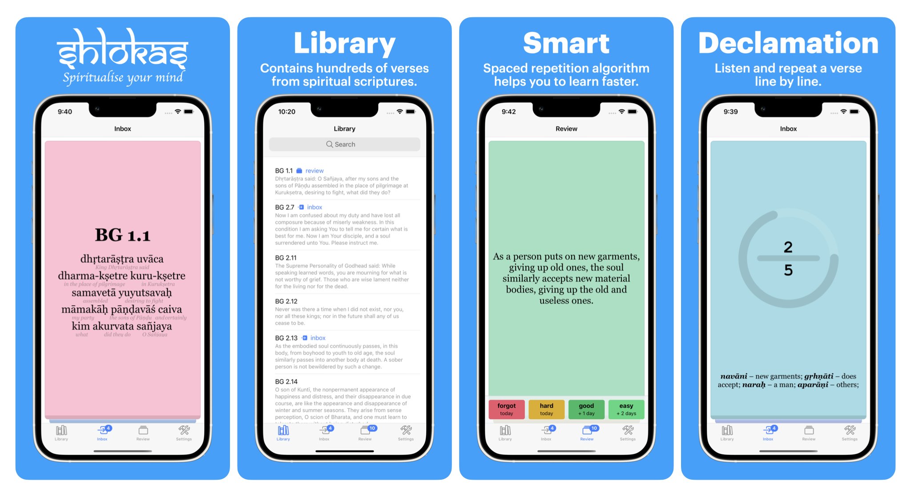

<p align="center">
    
</p>

<p align="center"><i>Enhance your spiritual practice and deepen your understanding of the Vedas with Shlokas, the mobile app that makes it easy to memorize and recite Vedic verses. <a href='https://shlokas.app'>Try it out</a> today and take your spiritual journey to the next level.</i></p><br>

<p align="center">
  <a href="https://shlokas.app">
    
  </a>
  <a href="https://apps.apple.com/rs/app/learn-shlokas/id1663506324">
    
  </a>
</p>


<p align="center">
  <a href="https://github.com/akdasa-studios/shlokas/actions/workflows/tests.yml"></a>
  <a href="https://codecov.io/gh/akdasa-studios/shlokas"></a>
  <a href="https://www.codacy.com/gh/akdasa-studios/shlokas/dashboard?utm_source=github.com&amp;utm_medium=referral&amp;utm_content=akdasa-studios/shlokas&amp;utm_campaign=Badge_Grade"></a>
  <a href="https://github.com/akdasa-studios/shlokas/issues?q=is%3Aissue+is%3Aopen+label%3A%22good+first+issue%22"></a>
  <a title="Crowdin" target="_blank" href="https://crowdin.com/project/shlokas"></a>
  <!--
  <a href="https://app.netlify.com/sites/shlokas-staging/deploys"></a>-->
</p>


## Get involved
If you'd like to help develop the project, here's a list of links to get you started:

1. [Good first issues](https://github.com/akdasa-studios/shlokas/issues?q=is%3Aissue+is%3Aopen+label%3A%22good+first+issue%22) – a list of simple issues any developer could start from.
2. [Roadmap](https://github.com/orgs/akdasa-studios/projects/1/views/7) - list of tasks we are working on.


## Documentation
1. [Architecture](./docs/architecture.md) – Overall project architecture
1. [Models](./docs/models.md) – Domain models

## Develop
1. `npm run dev` – run the application at `http://localhost:8080`
2. `npm run run:device` – run application on a device
3. `npm run run:device:hot` – run an application on a device with hot reloading

### Environment
To run the application in a full environment, you need to start all the services. You can do that by cloning the `shlokas-server` repository and running `./dev.run.sh` command.

```sh
# somewhere in your projects foledr outside of this repo
gh repo clone akdasa-studios/shlokas-server
cd ./shlokas-server
./dev.run.sh
```

The following services will be started:

| Repo                                                           | Description                                                                           | Link                       |
| -------------------------------------------------------------- | ------------------------------------------------------------------------------------- | -------------------------- |
| [Landing](https://github.com/akdasa-studios/shlokas-landing)   | Landing page.                                                                         | http://localhost           |
| [Admin](https://github.com/akdasa-studios/shlokas-admin)       | Admin panel to manage content. You can add verses, images, declamations and so on     | http://localhost/admin     |
| [Database](https://github.com/akdasa-studios/shlokas-db)       | Database and bootstrap scripts. Starts CouchDB and bootstraps it with necessary data. | http://localhost/db/_utils |
| [Auth](https://github.com/akdasa-studios/shlokas-auth)         | Authenticatoin service                                                                | No UI                      |
| [Balancer](https://github.com/akdasa-studios/shlokas-balancer) | Balancer                                                                              | No UI                      |
| [Content](https://github.com/akdasa-studios/shlokas-content)   | Content server. Allows to download and upload images and declamations                 | No UI                      |
| [TOTP](https://github.com/akdasa-studios/shlokas-totp)         | One time password service                                                             | No UI                      |
| Mailcather                                                     | Email service. Used only for debugging purposes in dev environment.                   | http://localhost:1080      |


## Related Repositories

| Repo                                                       | Description                            |
| ---------------------------------------------------------- | -------------------------------------- |
| [Core](https://github.com/akdasa-studios/shlokas-core)     | Core Library. Contains business logic. |
| [Server](https://github.com/akdasa-studios/shlokas-server) | Scripts to run related services        |
| [E2E](https://github.com/akdasa-studios/shlokas-e2e)       | End to end tests                       |
| [UiKit](https://github.com/akdasa-studios/shlokas-uikit)   | UI Kit                                 |
| [Utils](https://github.com/akdasa-studios/shlokas-utils)   | Utils                                  |
