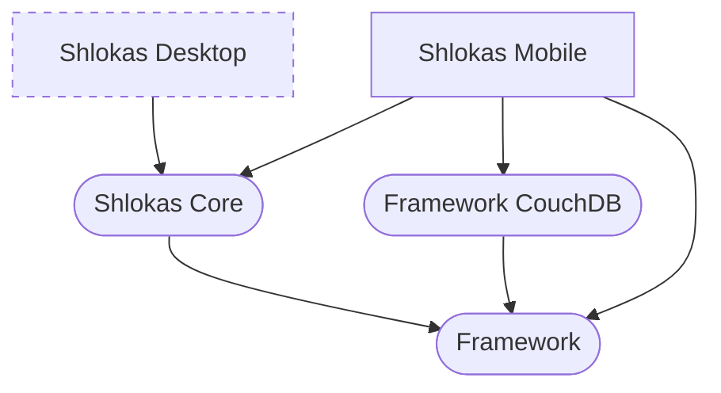

# Architecture

```mermaid
graph TD;

ShlokasDesktop["Shlokas Desktop"]-->ShlokasCore(["Shlokas Core"]);
ShlokasMobile["Shlokas Mobile"]-->ShlokasCore(["Shlokas Core"]);
ShlokasMobile["Shlokas Mobile"]-->FrameworkCouchDB(["Framework CouchDB"]);
ShlokasCore-->Framework(["Framework"]);
FrameworkCouchDB-->Framework;
ShlokasMobile-->Framework;

click ShlokasMobile "https://github.com/akdasa-studios/shlokas"
click ShlokasCore "https://github.com/akdasa-studios/shlokas-core"
click Framework "https://github.com/akdasa-studios/framework"

style ShlokasDesktop stroke-dasharray: 5 5
```