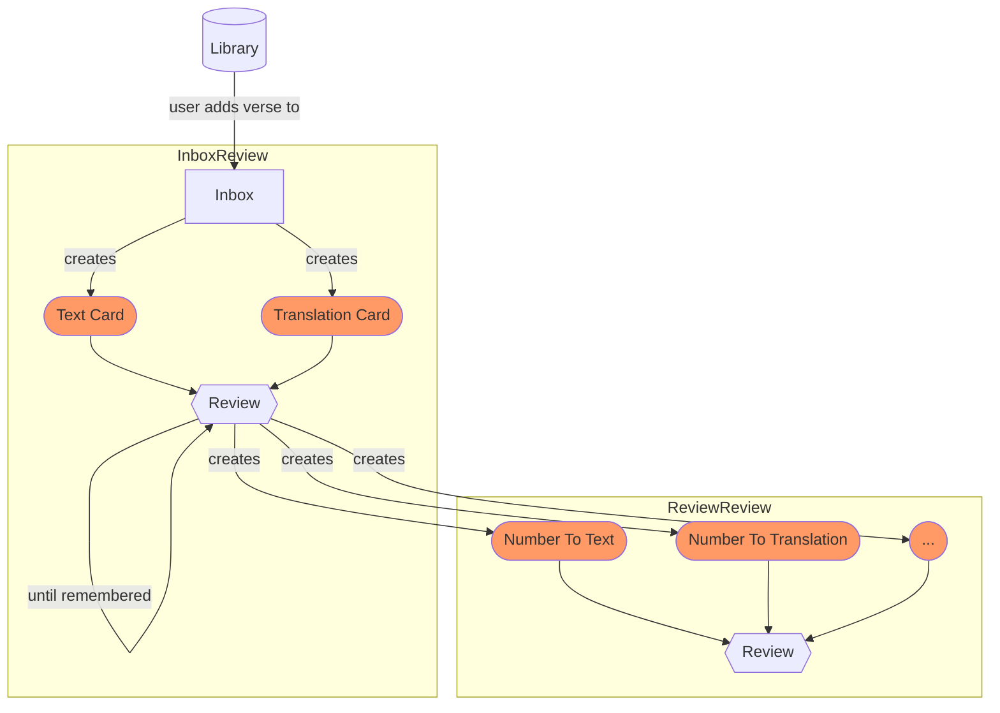

# Flow

```mermaid
flowchart TD
    classDef TCard fill:#f96;

    Library[(Library)] -- user adds verse to --> Inbox

    subgraph InboxReview
        Inbox -- creates --> TextCard(["Text Card"]):::TCard
        Inbox -- creates --> TranslationCard(["Translation Card"]):::TCard
    
        TextCard --> Review{{Review}}
        TranslationCard --> Review
    
        Review -- until remembered --> Review
    end

    subgraph ReviewReview
        Review -- creates --> ReviewCard1(["Number To Text"]):::TCard
        Review -- creates --> ReviewCard2(["Number To Translation"]):::TCard
        Review -- creates --> ReviewCard3(["..."]):::TCard

        ReviewCard1 --> Review2{{Review}}
        ReviewCard2 --> Review2{{Review}}
        ReviewCard3 --> Review2{{Review}}
    end
```