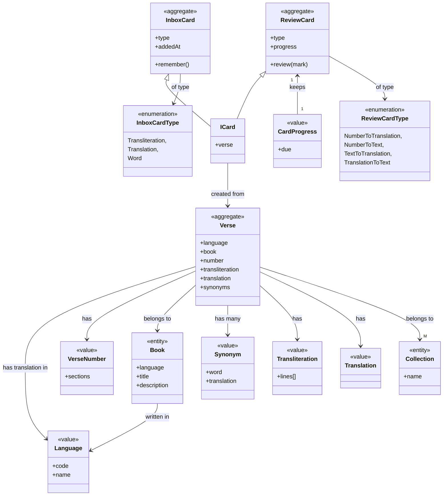

# Models

```mermaid
classDiagram

class Language {
    <<value>>
    +code
    +name
}

class VerseNumber {
    <<value>>
    +sections
}

class Collection {
    <<entity>>
    +name
}

class Book {
    <<entity>>
    +language
    +title
    +description
}

class Synonym {
    <<value>>
    +word
    +translation
}

class Verse {
    <<aggregate>>
    +language
    +book
    +number
    +transliteration
    +translation
    +synonyms
}

class Transliteration {
    <<value>>
    +lines[]
}

class Translation {
    <<value>>
}

class InboxCardType {
    <<enumeration>>
    Transliteration,
    Translation,
    Word
}

class ReviewCardType {
    <<enumeration>>
    NumberToTranslation,
    NumberToText,
    TextToTranslation,
    TranslationToText
}

class ICard {
    +verse
}

class InboxCard {
    <<aggregate>>
    +type
    +addedAt
    +remember()
}

class ReviewCard {
    <<aggregate>>
    +type
    +progress
    +review(mark)
}

class CardProgress {
    <<value>>
    +due
}

Book --> Language : written in

Verse --> Language : has translation in
Verse --> VerseNumber : has
Verse --> Book : belongs to
Verse --> Synonym : has many
Verse --> Transliteration : has
Verse --> Translation : has
Verse --> "M" Collection : belongs to

ICard --> Verse : created from

ReviewCard <|-- ICard
ReviewCard "1" <-- "1" CardProgress : keeps
ReviewCard --> ReviewCardType : of type

InboxCard <|-- ICard
InboxCard --> InboxCardType : of type
```