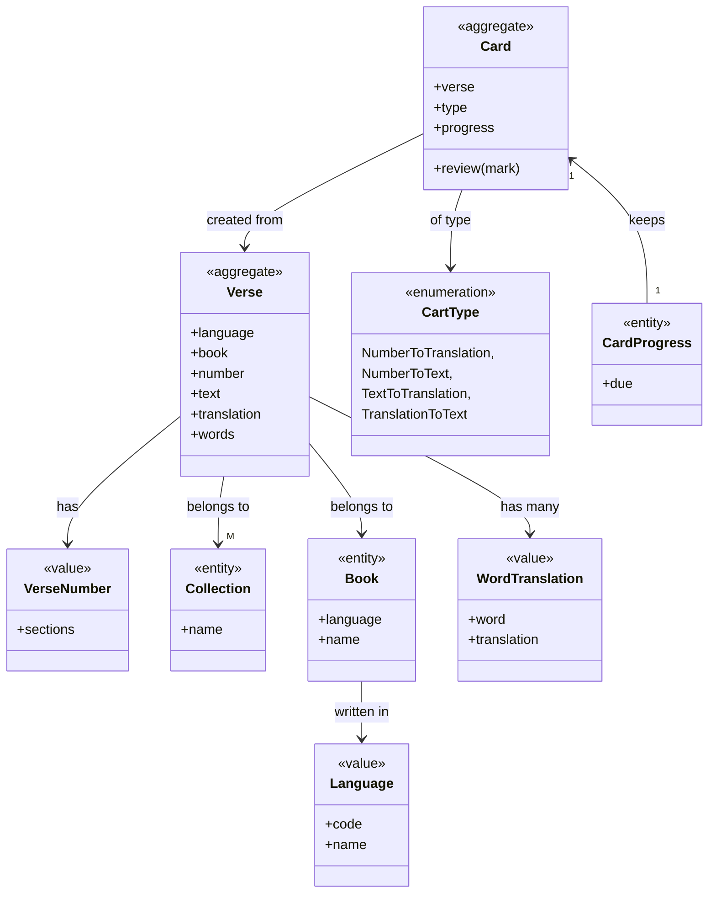

# Models

```mermaid
classDiagram

class Language {
    <<value>>
    +code
    +name
}

class VerseNumber {
    <<value>>
    +sections
}

class Collection {
    <<entity>>
    +name
}

class Book {
    <<entity>>
    +language
    +name
}

class WordTranslation {
    <<value>>
    +word
    +translation
}

class Verse {
    <<aggregate>>
    +language
    +book
    +number
    +text
    +translation
    +words
}

class CartType {
    <<enumeration>>
    NumberToTranslation,
    NumberToText,
    TextToTranslation,
    TranslationToText
}

class Card {
    <<aggregate>>
    +verse
    +type
    +progress
    +review(mark)
}

class CardProgress {
    <<entity>>
    +due
}

Book --> Language : written in
Verse --> VerseNumber : has
Verse --> Book : belongs to
Card --> Verse : created from
Verse --> WordTranslation : has many
Card "1" <-- "1" CardProgress : keeps
Verse --> "M" Collection : belongs to
Card --> CartType : of type
```